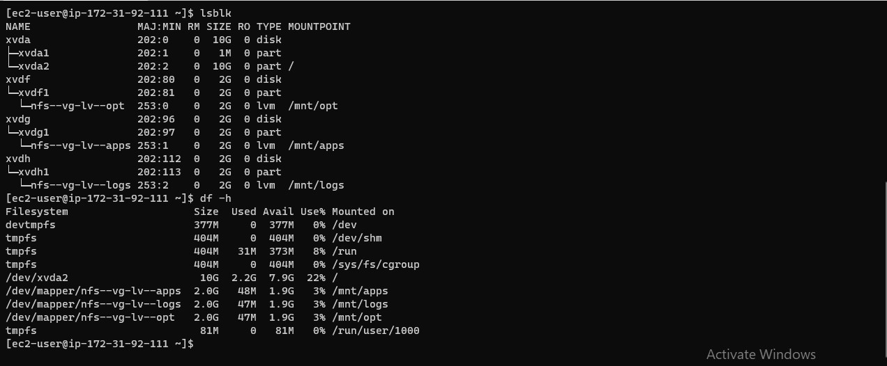
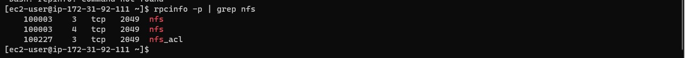
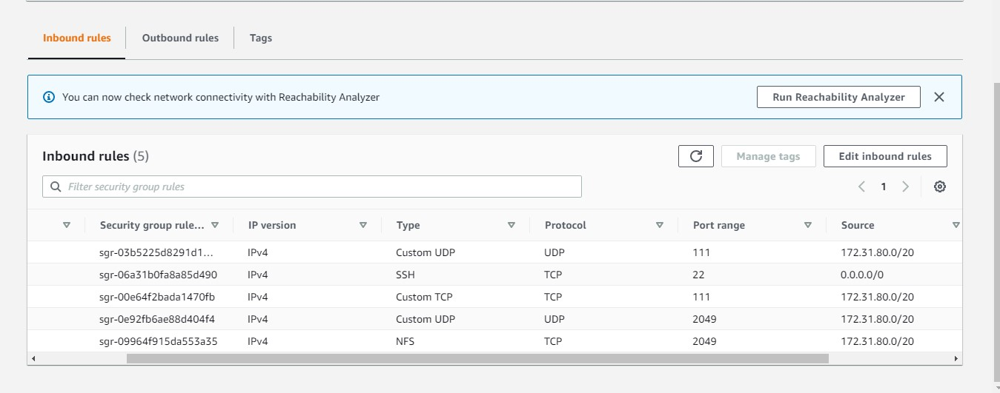

# **DEVOPS TOOLING WEBSITE SOLUTION** #
This project implements these technologies:
1.  Infrastructure: AWS
1.  Webserver Linux: Red Hat Enterprise Linux 8
1.  Database Server: Ubuntu 20.04 + MySQL
1.  Storage Server: Red Hat Enterprise Linux 8 + NFS Server
1.  Programming Language: PHP
1.  Code Repository: GitHub

We will implement the infrastructure design illustrated below:

### **STEP 1 – PREPARE NFS SERVER** ###

Lunch a new EC2 Instance of Red Hat Linux 8 OS

Configure LVM with 3 EBS volumes

Instead of formating the disks as ext4 you will have to format them as *xfs*
Ensure there are 3 Logical Volumes. lv-opt lv-apps, and lv-logs

You should have a similar output to below when you are done 

Create mount points on */mnt* directory for the logical volumes as follow:
Mount lv-apps on */mnt/apps* – To be used by webservers
Mount lv-logs on */mnt/logs* – To be used by webserver logs
Mount lv-opt on */mnt/opt* – To be used by Jenkins server in the next project

Install NFS server, configure it to start on reboot and make sure it is u and running
~~~
sudo yum -y update
sudo yum install nfs-utils -y
sudo systemctl start nfs-server.service
sudo systemctl enable nfs-server.service
sudo systemctl status nfs-server.service
~~~

Export the mounts for webservers’ **subnet cidr** to connect as clients. For simplicity, you will install your all three Web Servers inside the same subnet, but in production set up you would probably want to separate each tier inside its own subnet for higher level of security.

Make sure we set up permission that will allow our Web servers to read, write and execute files on NFS:
~~~
sudo chown -R nobody: /mnt/apps
sudo chown -R nobody: /mnt/logs
sudo chown -R nobody: /mnt/opt

sudo chmod -R 777 /mnt/apps
sudo chmod -R 777 /mnt/logs
sudo chmod -R 777 /mnt/opt

sudo systemctl restart nfs-server.service
~~~

Configure access to NFS for clients within the same subnet (example of Subnet CIDR – 172.31.80.0/20 ):
~~~
sudo vi /etc/exports

/mnt/apps <172.31.80.0/20>(rw,sync,no_all_squash,no_root_squash)
/mnt/logs <172.31.80.0/20>(rw,sync,no_all_squash,no_root_squash)
/mnt/opt <172.31.80.0/20>(rw,sync,no_all_squash,no_root_squash)

Esc + :wq!

sudo exportfs -arv
~~~

Check which port is used by NFS and open it using Security Groups (add new Inbound Rule)
~~~
rpcinfo -p | grep nfs
~~~

In order for NFS server to be accessible from your client, you must also open following ports: TCP 111, UDP 111, UDP 2049

### **STEP 2 — CONFIGURE THE DATABASE SERVER** ###

**Install MySQL server**
1. Create a database and name it tooling
1. Create a database user and name it webaccess
1. Grant permission to webaccess user on tooling database to do anything only from the webservers subnet cidr (172.31.80.0/20)

### **STEP 3 — PREPARE THE WEB SERVERS** ###

We need to make sure that our Web Servers can serve the same content from shared storage solutions, in our case – NFS Server and MySQL database.
You already know that one DB can be accessed for reads and writes by multiple clients. For storing shared files that our Web Servers will use – we will utilize NFS and mount previously created Logical Volume lv-apps to the folder where Apache stores files to be served to the users (/var/www).

During the next steps we will do following:

During the next steps we will do following:

1. Configure NFS client (this step must be done on all three servers)
1. Deploy a Tooling application to our Web Servers into a shared NFS folder
1. Configure the Web Servers to work with a single MySQL database

